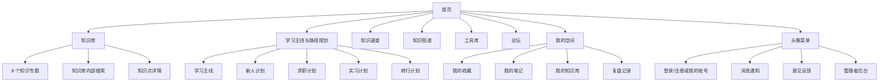
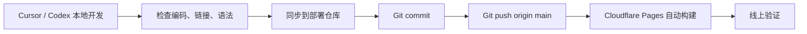

# PDM Lab 网站内容、框架与体系

## 1. 网站定位

PDM Lab 是一个面向产品人的知识库管理与速查空间。它的核心不是单纯课程站，而是帮助产品人完成：

- 系统管理产品知识
- 快速查询方法、术语和案例
- 沉淀个人经验与复盘
- 通过学习主线和路径规划辅助新人上手

## 2. 用户人群

### 核心用户
- 产品新人：需要建立 PM 基础认知和方法框架。
- 求职者：需要准备产品八股、项目表达、作品集和面试。
- 实习生：需要理解需求、PRD、协作、上线和复盘。
- 转行者：需要快速建立行业、岗位、流程和工具认知。
- 已入门产品人：需要一个可查、可收藏、可沉淀的个人知识空间。

### 管理用户
- 超级管理员：维护公共知识库、角色权限、反馈、通知、全站内容。
- 普通登录用户：收藏、笔记、复盘、我的知识库、论坛互动。
- 未登录访客：浏览公开知识库、学习路径、工具、论坛帖子。

## 3. 信息架构

## 4. 首页框架

首页承担“定位 + 搜索 + 高频入口 + 新人辅助”的作用。

### 首屏
- 标题：产品小白的 DevDoc
- 品牌：PM Lab，使用适配整体色调的渐变。
- 搜索：中英文统一为 `Ask me anything`。
- 定位文案：管理你的产品知识、沉淀经验、快速查找方法与术语。

### 核心入口
- 知识库：主入口，承载 8 个专题和全部知识点。
- 知识速查：按术语快速查找。
- 知识图谱：按 8 个主题可视化查看知识结构。
- 学习主线：主推的新手学习入口。

### 辅助入口
- 新人计划、求职计划、实习计划、转行计划。
- 工具库、论坛、我的空间。
- 关于本站保留在底部，不抢主视觉。

## 5. 知识库体系

知识库是网站核心，当前以 Markdown 公共知识库为主要内容源，并生成前端静态数据。

### 8 个知识专题
1. PM 方法论
2. 技术架构
3. 业务管理
4. 权限安全
5. 工作流程
6. 每日学习
7. 产品八股
8. 求职

> 具体专题顺序和数量应以当前知识库数据为准，首页与图谱不得写死。

### 知识点结构
每个知识点应尽量包含：
- 核心解释：一句话讲清概念。
- 适用场景：什么时候用。
- 案例：用真实但脱敏的业务场景说明。
- PM 应用：产品经理该如何写需求、评审、验收或沟通。
- 常见误区：避免用户只懂概念不会落地。
- 相关知识：链接到其他知识点。

### 内容风格
- 不写“补充完善”等编辑痕迹。
- 避免大段文字堆叠。
- 用小标题、短段落、列表、轻量分隔组织阅读。
- 私有案例必须脱敏，不出现客户、公司、内部系统真实敏感名称。

## 6. 学习体系

学习体系是辅助，不替代知识库核心定位。

### 学习主线
- 主推入口。
- 按知识库体系循序渐进。
- 适合不知道从哪里开始的新用户。

### 4 个路径规划
- 新人计划：帮助产品新人建立基础认知。
- 求职计划：围绕面试、作品集、项目表达和八股。
- 实习计划：围绕 PRD、协作、交付、上线和复盘。
- 转行计划：围绕角色认知、能力迁移、行业理解和项目补足。

### 跳转原则
- 所有按钮必须链接到真实存在的知识点或页面。
- 路径跳转后返回，应回到点击前的路径页面。
- 不允许出现空链接、坏链接、内容不存在。

## 7. 功能模块

### 知识库
- 公开知识浏览
- 内部搜索
- 知识速查
- 知识图谱
- 文章详情
- 原创声明
- 复制权限控制

### 我的空间
- 我的收藏
- 我的笔记
- 我的知识库
- 复盘记录

### 我的账号
- 邮箱
- 昵称
- 修改密码
- 退出登录

### 管理者后台
- 用户角色
- 权限配置
- 反馈管理
- 知识管理
- 内容复制权限
- 全站发布控制

### 社区与互动
- 论坛帖子
- 评论回复
- 消息通知
- 意见反馈

## 8. 技术框架

### 前端
- 静态站点结构位于 `site`。
- 主要页面逻辑在 `site/app.js`。
- 知识库 UI 在 `site/knowledge-views.js`。
- 知识数据在 `site/data.js`。
- 多语言在 `site/locales/zh-CN.js` 和 `site/locales/en-US.js`。
- 样式在 `site/styles.css` 与 `site/chrome.css`。

### 知识数据
- Markdown 源文件位于 `knowledge`。
- 导入脚本：`scripts/import-knowledge-base.mjs`。
- 同步脚本：`scripts/sync-knowledge.mjs`。
- 生成配置：`scripts/write-config.mjs`。
- 生成数据：`src/data/knowledge-from-md.json`、`site/data.js`。

### 后端服务
- Supabase 提供登录、用户、角色、反馈、论坛、通知、我的知识库等数据能力。
- SQL 位于 `supabase`。
- Cloudflare Pages 承载静态站点并从 GitHub 自动部署。

## 9. 发布链路

## 10. 项目原则

- 知识库优先，学习路径辅助。
- 视觉简洁，不让功能卡片抢主次。
- 双端适配，每次改 UI 同时看移动端。
- 数据联动，不写死专题数和知识点数。
- 所有跳转可达，不允许空白页。
- 内容脱敏，不暴露真实客户或内部系统。
- 发布前跑检查，避免乱码和坏链接上线。

