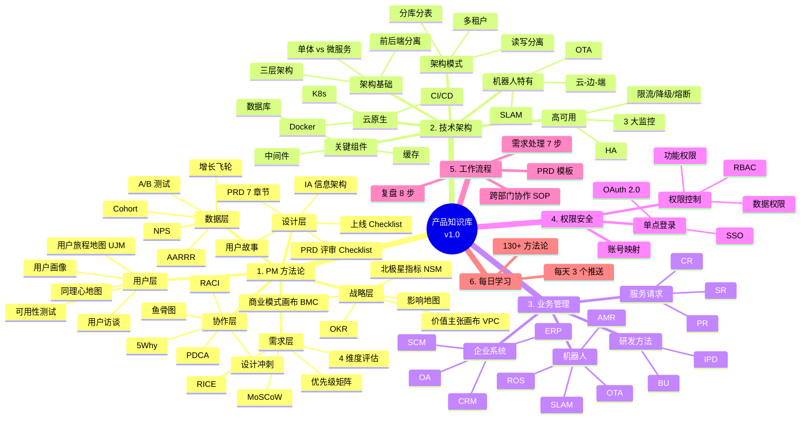
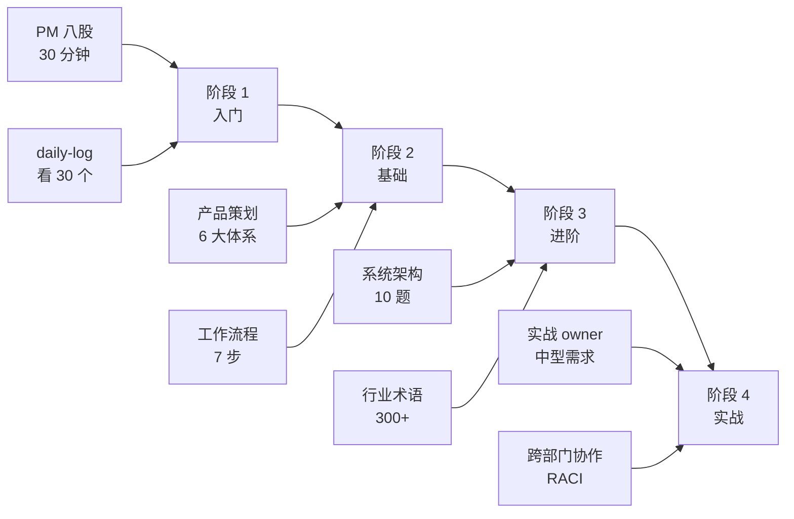
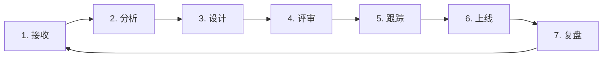

# 6 大主题知识图谱

> 用 Mermaid 画的全景图

---

## 主图谱

```mermaid
mindmap
  root((产品知识库<br/>v1.0))
    1. PM 方法论
      战略层
        北极星指标 NSM
        商业模式画布 BMC
        价值主张画布 VPC
        OKR
        影响地图
      用户层
        用户画像
        同理心地图
        用户旅程地图 UJM
        可用性测试
        用户访谈
      需求层
        4 维度评估
        RICE
        MoSCoW
        优先级矩阵
      设计层
        用户故事
        IA 信息架构
        PRD 7 章节
        PRD 评审 Checklist
        上线 Checklist
      数据层
        AARRR
        Cohort
        NPS
        A/B 测试
        增长飞轮
      协作层
        RACI
        5Why
        PDCA
        鱼骨图
        设计冲刺
    2. 技术架构
      架构基础
        三层架构
        单体 vs 微服务
        前后端分离
      关键组件
        数据库
        中间件
        缓存
      架构模式
        多租户
        读写分离
        分库分表
      高可用
        HA
        限流/降级/熔断
        3 大监控
      云原生
        Docker
        K8s
        CI/CD
      机器人特有
        云-边-端
        OTA
        SLAM
    3. 业务管理
      企业系统
        ERP
        CRM
        SCM
        OA
      机器人
        AMR
        SLAM
        ROS
        OTA
      研发方法
        IPD
        BU
      服务请求
        SR
        PR
        CR
    4. 权限安全
      单点登录
        SSO
        OAuth 2.0
      账号映射
      权限控制
        RBAC
        功能权限
        数据权限
    5. 工作流程
      需求处理 7 步
      PRD 模板
      跨部门协作 SOP
      复盘 8 步
    6. 每日学习
      130+ 方法论
      每天 3 个推送
```

## 4 阶段学习路径图

```mermaid
graph LR
  A[阶段 1<br/>入门] --> B[阶段 2<br/>基础]
  B --> C[阶段 3<br/>进阶]
  C --> D[阶段 4<br/>实战]

  A1[PM 八股<br/>30 分钟] --> A
  A2[daily-log<br/>看 30 个] --> A

  B1[产品策划<br/>6 大体系] --> B
  B2[工作流程<br/>7 步] --> B

  C1[系统架构<br/>10 题] --> C
  C2[行业术语<br/>300+] --> C

  D1[实战 owner<br/>中型需求] --> D
  D2[跨部门协作<br/>RACI] --> D
```

## 需求处理 7 步流程

```mermaid
graph LR
  A[1. 接收] --> B[2. 分析]
  B --> C[3. 设计]
  C --> D[4. 评审]
  D --> E[5. 跟踪]
  E --> F[6. 上线]
  F --> G[7. 复盘]
  G --> A
```

---

*注:Mermaid 语法可在 GitHub / VS Code / 飞书云文档直接渲染*
